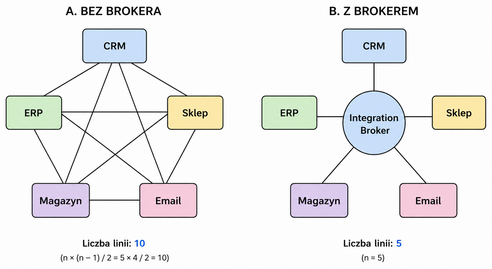

# Lesson 1 — What is Integration?

**Phase:** 1 — Integration Architecture Fundamentals  
**Week:** 1  
**Day:** Monday  

---

## Key Concepts

### The N×(N-1) Problem

Without a broker, every system must connect directly to every other system.  
The number of directional connections grows quadratically:

| Number of systems | Connections without broker | Connections with broker |
|:-:|:-:|:-:|
| 3 | 6 | 3 |
| 5 | 20 | 5 |
| 10 | 90 | 10 |
| 20 | 380 | 20 |

**Formula:** `n × (n-1)` — directional connections  
**Formula:** `n × (n-1) / 2` — unique connections (undirected)

Each direct connection requires its own contract, authentication, error handling,  
and documentation. This is exactly the integration chaos found in large enterprises.

### Integration Broker

Centralizes communication — every system only talks to the broker.  
Adding a new system = 1 new connection, not N new ones.

Examples: MuleSoft Anypoint Platform, Dell Boomi, Azure Integration Services, Apache Kafka.

---

## Diagram



- **A. Without broker** — 5 systems, 10 unique / 20 directional connections
- **B. With broker** — 5 systems, 5 connections

---

## My Environment — Synerise as a Real-World Example

### Systems in the ecosystem
- Websites and mobile applications
- POS terminals in physical stores
- External APIs (partners, suppliers)
- Data warehouses: Azure, Google Cloud (BigQuery)
- ERP, CRM

### Data flows
**Synerise is almost always the target** — data flows in from all sources  
as events (user behavior) or profiles (customer data).  
Occasionally Synerise sends data outbound (e.g. to email platforms, CRM).

### Transports
| Transport | Use case |
|---|---|
| REST API | Main channel for events and profiles |
| Webhooks (Automation module) | Outbound triggers from Synerise |
| Native integrations | Azure Blob Storage, Google Cloud |

### Error handling — current state
- Event count monitoring — alerts on drops
- Retry: maximum 1 retry attempt (limitation of the Automation module)
- **Risk:** a single retry does not protect against temporary unavailability — standard is 3–5 attempts with exponential backoff

---

## Architectural Observations

### 1. Synerise = Aggregator, not Broker
A classic **Integration Broker** routes data *between* systems.  
Synerise **aggregates** data *into itself* from many sources — this is the **Aggregator** pattern in EIP.  
An important distinction when talking to clients and designing architectures.

### 2. One retry is not enough
Production standard: **3–5 attempts** with exponential backoff:
```
attempt 1: immediately
attempt 2: after 1s
attempt 3: after 2s
attempt 4: after 4s
attempt 5: after 8s
```
A single retry does not protect against temporary unavailability of the target system.  
→ Solution: **Dead Letter Queue** (Lesson 4)

### 3. Three transports = three error models
Each transport (API, webhooks, native integrations) has its own:
- error model
- retry strategy
- monitoring approach

An integration broker unifies all of this in one place.

---

## Open Questions
- How to design retry for webhooks that don't support it? → **Lesson 4 (Dead Letter Queue)**
- What happens to an event that never arrived and has no retry? → **Lesson 4**

---

## Anki Cards

| Front | Back |
|---|---|
| Formula for directional connections between N systems without a broker? | `n × (n-1)` |
| 10 systems without a broker = how many directional connections? | 90 |
| What does an Integration Broker do? | Centralizes communication — every system only talks to the broker, adding a system = 1 new connection |
| What is the difference between an Aggregator and a Broker? | A Broker routes data between systems. An Aggregator collects data into itself from many sources. |
| What is the risk of having only 1 retry for webhooks? | Does not protect against temporary unavailability — data can be lost silently |
| What is the name of the quadratic connection growth problem? | The N×(N-1) problem |
| Production retry standard? | 3–5 attempts with exponential backoff (1s → 2s → 4s → 8s...) |

---

## Resources
- [Enterprise Integration Patterns — Gregor Hohpe](https://www.enterpriseintegrationpatterns.com)
- [MuleSoft — Why Integration Matters](https://www.youtube.com/results?search_query=mulesoft+why+integration+matters)

---

*Next lesson: **Lesson 2 — Message as the Building Block of Integration***  
*You will learn: Header, Body, Correlation ID — we will break down a real Synerise webhook using EIP concepts.*
